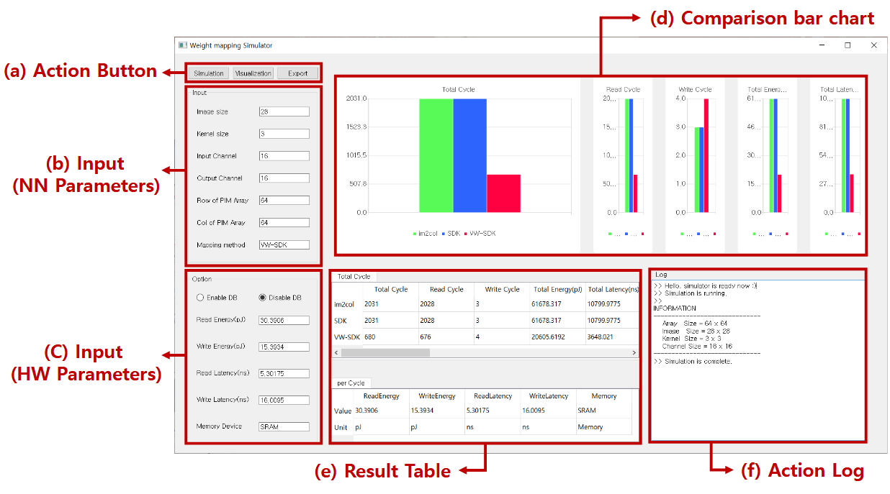
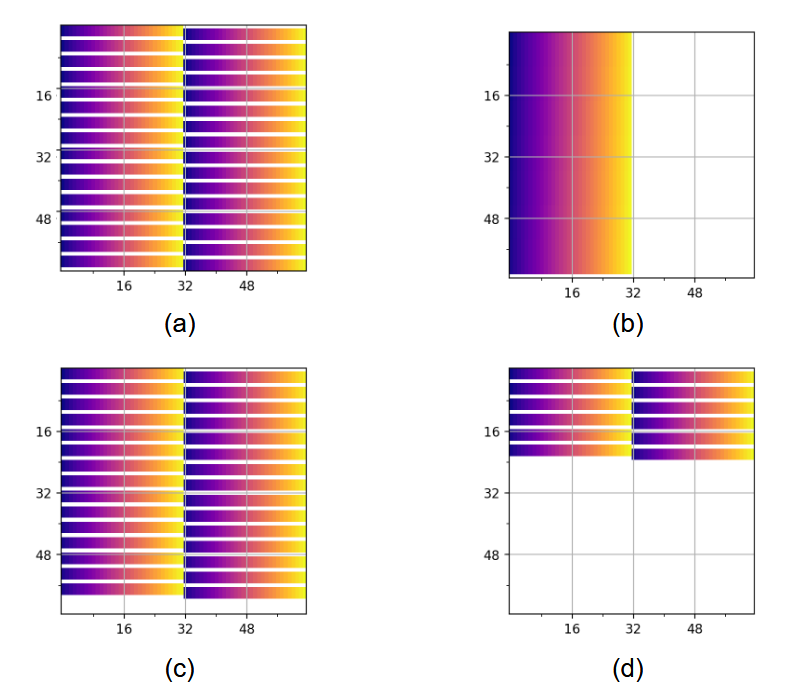

# ConvMapSim: Modeling and Simulating Convolutional Network Mapping for PIM Arrays
---
## Abstract
Convolutional network mapping plays a stapling role in processing-in-memory (PIM) systems by transforming activations and convolutional weight tensors into a set of vectors and matrices to facilitate convolution operation in the form of matrix-
vector multiplication (MVM) operation. Although the design and choice of the model mapping method have a significant impact on the PIM system’s latency and energy efficiency, existing PIM simulators lack the flexibility to evaluate and compare various
mapping methods. Moreover, a rigorous definition and formulation of network mapping problems are yet to be established. To address this issue, this paper first proposes a formal definition of the convolutional model mapping problem and also a rigorous
mathematical model that characterizes mapping methods. Based on the proposed model, we develop ConvMapSim, a novel simulation platform that calculates energy and latency performance of state-of-the-art mapping methods, considering various neural
networks and hardware parameters. The platform also generates visualizations of mapping methods, intuitively providing insights into their structures and behaviors. To the best of our knowledge, ConvMapSim is the first simulation platform that comprehen-
sively evaluates and visualizes the performance of different model mapping methods.

## Requirements
+ python3.x+

## Usage

### main_GUI.py
* This code includes GUI function, and calculates the total computing cycle, latency and power, and shows comparision chart according to the mapping methods (im2col, SDK, VW-SDK).
* You have to input some neural networks parameters and hardware parameters for calculation using Parser on GUI.

### function_Logic.py
* This code calculates the computing cycle and shows structures according to the mapping methods (im2col, SDK, VW-SDK).

### simulator_main.ui
* This code expresses the GUI and is functionally linked with the main_GUI.py code.

### SimulationDB.csv
* This file contains hardware parameter information as an example for simulation, and user can use this file to input hardware parameter information, or input directly into GUI.

### Example and results
After the user inputs the neural networks parameters and hardware parameters in the GUI, the simulation results are displayed as shown below.

---
## Mapping methods

### Im2col (Image to column)

Each kernel with size KxKxIC (where K is kernel, IC is input channel) is unrolled into the column. A kernel-sized window in an input feature map (IFM) is convolved with the kernel.

### SDK (Shift and Duplicate Kernel)

This mapping computes multiple windows instead of single window simultaneously in each cycle. To reuses the input data, this method forms the parallel window that is a set of windows. Thus, it obtains multiple output feature maps (OFMs) by utilizing the PIM array.

### VW-SDK (Shift and Duplicate Kernel)

The shape of the PW was forced to be square for SDK. Therefore, the search space for optimal PW dimension was limited. To address this issue, variable-window shift and duplicate kernel (VW-SDK) is proposed a generalization of SDK, which allowed the use of both square-shaped and rectangular PW.
